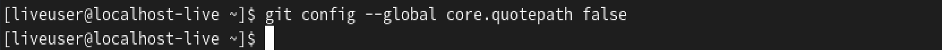

---
## Front matter
title: "Лабораторная работа №2"
subtitle: "Система контроля версий Git"
author: "Коровкин Никита Михайлович"

## Generic otions
lang: ru-RU
toc-title: "Содержание"

## Bibliography
bibliography: bib/cite.bib
csl: pandoc/csl/gost-r-7-0-5-2008-numeric.csl

## Pdf output format
toc: true # Table of contents
toc-depth: 2
lof: true # List of figures
lot: true # List of tables
fontsize: 12pt
linestretch: 1.5
papersize: a4
documentclass: scrreprt
## I18n polyglossia
polyglossia-lang:
  name: russian
  options:
	- spelling=modern
	- babelshorthands=true
polyglossia-otherlangs:
  name: english
## I18n babel
babel-lang: russian
babel-otherlangs: english
## Fonts
mainfont: IBM Plex Serif
romanfont: IBM Plex Serif
sansfont: IBM Plex Sans
monofont: IBM Plex Mono
mathfont: STIX Two Math
mainfontoptions: Ligatures=Common,Ligatures=TeX,Scale=0.94
romanfontoptions: Ligatures=Common,Ligatures=TeX,Scale=0.94
sansfontoptions: Ligatures=Common,Ligatures=TeX,Scale=MatchLowercase,Scale=0.94
monofontoptions: Scale=MatchLowercase,Scale=0.94,FakeStretch=0.9
mathfontoptions:
## Biblatex
biblatex: true
biblio-style: "gost-numeric"
biblatexoptions:
  - parentracker=true
  - backend=biber
  - hyperref=auto
  - language=auto
  - autolang=other*
  - citestyle=gost-numeric
## Pandoc-crossref LaTeX customization
figureTitle: "Рис."
tableTitle: "Таблица"
listingTitle: "Листинг"
lofTitle: "Список иллюстраций"
lotTitle: "Список таблиц"
lolTitle: "Листинги"
## Misc options
indent: true
header-includes:
  - \usepackage{indentfirst}
  - \usepackage{float} # keep figures where there are in the text
  - \floatplacement{figure}{H} # keep figures where there are in the text
---

# Цель работы

Целью работы является изучить идеологию и применение средств контроля версий. Приобрести практические навыки по работе с системой git.

# Выполнение лабораторной работы

Перед началом работы с git нам необходимо сперва установить его, а затем сделать предварительную конфигурацию (см. рис. 1):

Откроем терминал и введём первые две команды. В них укажем имя и email владельца репозитория (см. рис. 2).

После того, как мы задали имя пользователя и адрес электронной почты, введём команду, чтобы настроить utf-8 в выводе сообщений git (см. рис. 3).

Теперь мы зададим имя начальной ветки. Она будет называться master (см. рис. 4).

Затем зададим следующие два параметра: autocrlf и safecrlf (см. рис. 5).
Параметр autocrlf нужен для того, чтобы в главном репозитории все переводы строк в текстовых файлах были одинаковы.
А команда safecrlf проверяет обратимость преобразования для текущей настройки.

Чтобы продолжить работу, нам необходимо сперва сгенерировать открытый SSH ключ.
Он необходим для индентификации пользователя на сервере репозиториев.
В качествем аргументов необходимо указать свое имя и электронную почту(см.рис. 6).

Теперь вставим этот ключ в специальное поле на сайте GitHub.
Оно находится в разделе settings. Перейдя в settings, найдём пункт SSH и GPS keys. Нажимаем на SSH key, вставляем ключ в нужное поле(см.рис.7-9).

Сгенерированный SSH ключ мы копируем в буфер обмена при помощи команды cat ~/.ssh/id_rsa.pub | xclip -sel clip (см.рис.10).

После того, как мы добавили ключ нам необходимо при помощи терминала создать каталог «Архитектура компьютера» (см.рис.11).

Теперь на сайте GitHub нам нужно будет создать репозиторий курса на основе шаблона. Шаблон находится по данному адресу: https://github.com/yamadharma/cour
se-directory-student-template. 
Перейдя по ссылке, нажимаем «use this template» и создаём свой репозиторий(см.рис.12-13).

Теперь, когда репозиторий создан на сайте, нам необходимо клонировать его. Для этого воспользуемся приведенной ниже командой(см.рис.14).

На рисунке выше(см.рис.15) изображен весь процесс клонирования. После того, как процесс завершен, можно перейти к следующему этапу – настройке каталога курса.

Для этого сперва перейдем в нужный каталог с помощью cd ~/work/study/2024-2025/"Архитектура компьютера"/arch-pc (см.рис.16)

Теперь удалим ненужные файлы при помощи команды rm(см.рис.17)

После того, как все лишние файлы удалены, создадим новые при помощи команд echo arch-pc > COURSE и make(см.рис.18).

Следующий этап – отправка файлов на сервер.
Для этого мы воспользуемся командой git add . , которая предназначена для добавления на сервер сразу всех файлов и каталогов.
После этого пропишем команду git commit -am 'feat(main): make course structure'. Она сохраняет внесённые изменения и добавляет комментарий (см.рис.19).

Теперь воспользуемся командой push, чтобы загрузить все изменения на сервер(см.рис.20).

Остаётся только сравнить файлы GitHub с файлами на компьютере (см.рис.21-22).

Файлы совпадают, значит работа выполнена правильно.

# Выполнение заданий для самостоятельной работы

Приступим к выполнению самостоятельной работы. Для этого сперва создадим файл отчёта. Для этого воспользуемся LibreOffice(см.рис.23).

Сохраним файл отчёта в нужном каталоге(см.рис.24)

Теперь, когда наш файл сохранен, скопируем отчёт о предыдущей лабораторной работе в каталог labs/lab01/report. Для этого воспользуемся командой cp(см.рис.25).

Остаётся только отправить наши файлы и каталоги на сервер.
Для этого проделаем те же самые действия, что и в основной части лабораторной работы.
Сперва добавляем файлы и каталог, используем commit для утверждения изменений и отправляем на сервер при помощи push(см.рис.26-27).

Проверим, получилось ли правильно загрузить файлы на GitHub(см.рис.28). Как мы видим, нужные каталоги на месте. Работа выполнена верно.

# Выводы

В ходе выполнения данной лабораторной работы были получены навыки работы с системой контроля версий Git, такие как: первоначальная настройка системы, создание репозитория, изменение, сохранение и загрузка файлов на сервер.
