---
## Front matter
title: "Лабораторная работа №3"
subtitle: "Язык разметки Markdown"
author: "Коровкин Никита Михайлович"

## Generic otions
lang: ru-RU
toc-title: "Содержание"

## Bibliography
bibliography: bib/cite.bib
csl: pandoc/csl/gost-r-7-0-5-2008-numeric.csl

## Pdf output format
toc: true # Table of contents
toc-depth: 2
lof: true # List of figures
lot: true # List of tables
fontsize: 12pt
linestretch: 1.5
papersize: a4
documentclass: scrreprt
## I18n polyglossia
polyglossia-lang:
  name: russian
  options:
	- spelling=modern
	- babelshorthands=true
polyglossia-otherlangs:
  name: english
## I18n babel
babel-lang: russian
babel-otherlangs: english
## Fonts
mainfont: IBM Plex Serif
romanfont: IBM Plex Serif
sansfont: IBM Plex Sans
monofont: IBM Plex Mono
mathfont: STIX Two Math
mainfontoptions: Ligatures=Common,Ligatures=TeX,Scale=0.94
romanfontoptions: Ligatures=Common,Ligatures=TeX,Scale=0.94
sansfontoptions: Ligatures=Common,Ligatures=TeX,Scale=MatchLowercase,Scale=0.94
monofontoptions: Scale=MatchLowercase,Scale=0.94,FakeStretch=0.9
mathfontoptions:
## Biblatex
biblatex: true
biblio-style: "gost-numeric"
biblatexoptions:
  - parentracker=true
  - backend=biber
  - hyperref=auto
  - language=auto
  - autolang=other*
  - citestyle=gost-numeric
## Pandoc-crossref LaTeX customization
figureTitle: "Рис."
tableTitle: "Таблица"
listingTitle: "Листинг"
lofTitle: "Список иллюстраций"
lotTitle: "Список таблиц"
lolTitle: "Листинги"
## Misc options
indent: true
header-includes:
  - \usepackage{indentfirst}
  - \usepackage{float} # keep figures where there are in the text
  - \floatplacement{figure}{H} # keep figures where there are in the text
---

# Цель работы

Целью работы является получение практических и теоретических навыков работы с языком разметки Markdown на примере оформления отчёта лабораторной работы

# Выполнение лабораторной работы
Сперва откроем терминал и перейдем в каталог курса.Обновим наш локальный репозиторий,использу команду pull (рис.1)

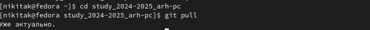

Теперь перейдем в каталог третей лабораторной работы с шаблоном отчета.

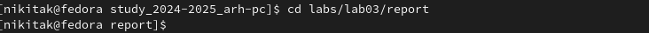

Скомпилируем шаблон с помощью Makefile.
Для этого воспользуемся командой make(рис.3)

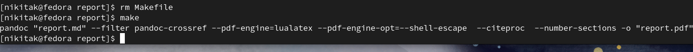

Проверим, создались ли нужные файлы .docx и .pdf(рис.4)

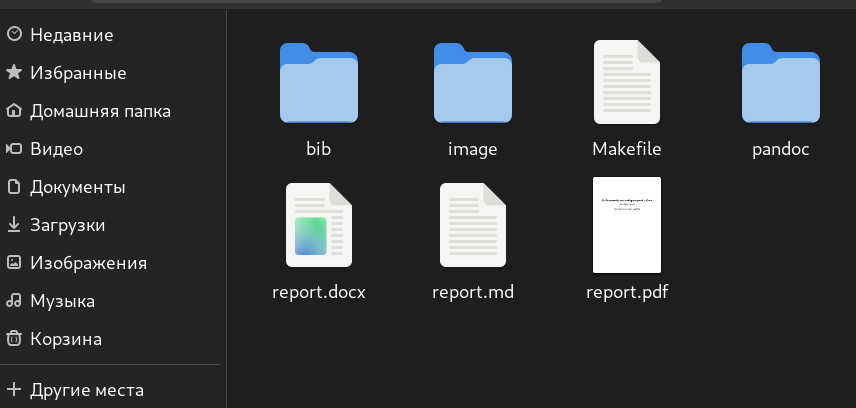

Теперь откроем каждый из файлов(рис.5-6)

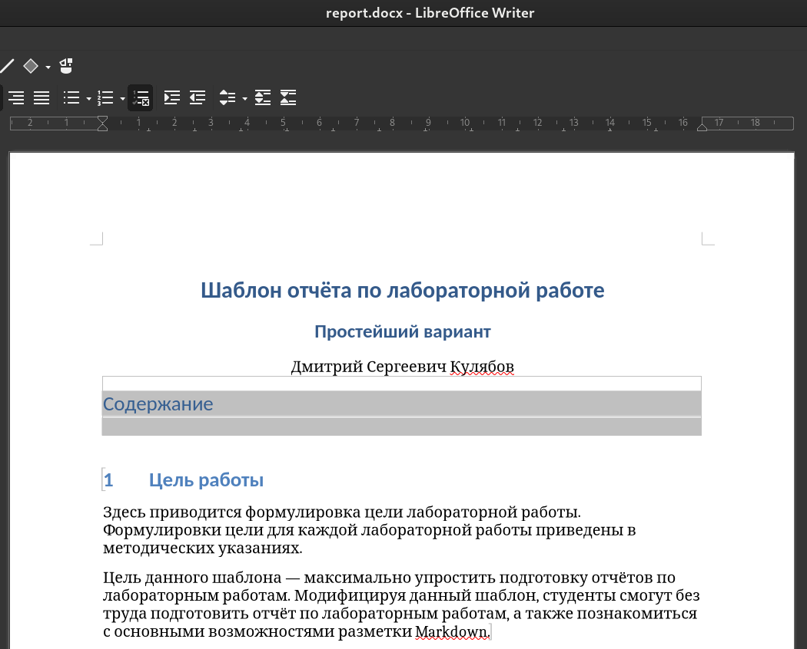

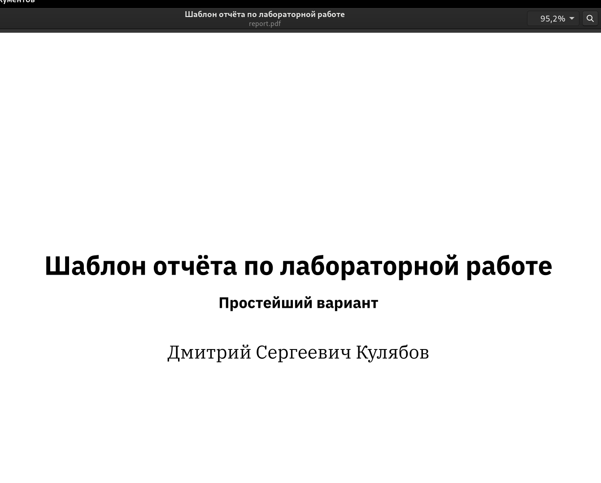

Далее предстоит удалить эти файлы при помощи make clean(рис.7)

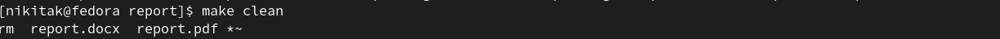

Проверим,удалились ли нужные файлы(рис.8)

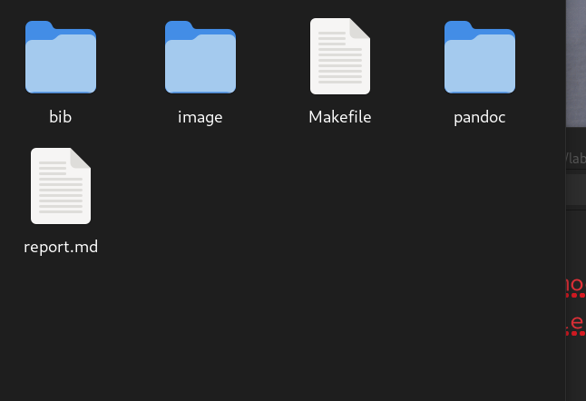

Теперь откроем файл отчёта report.md с помощью редактора gedit (Рис.9)

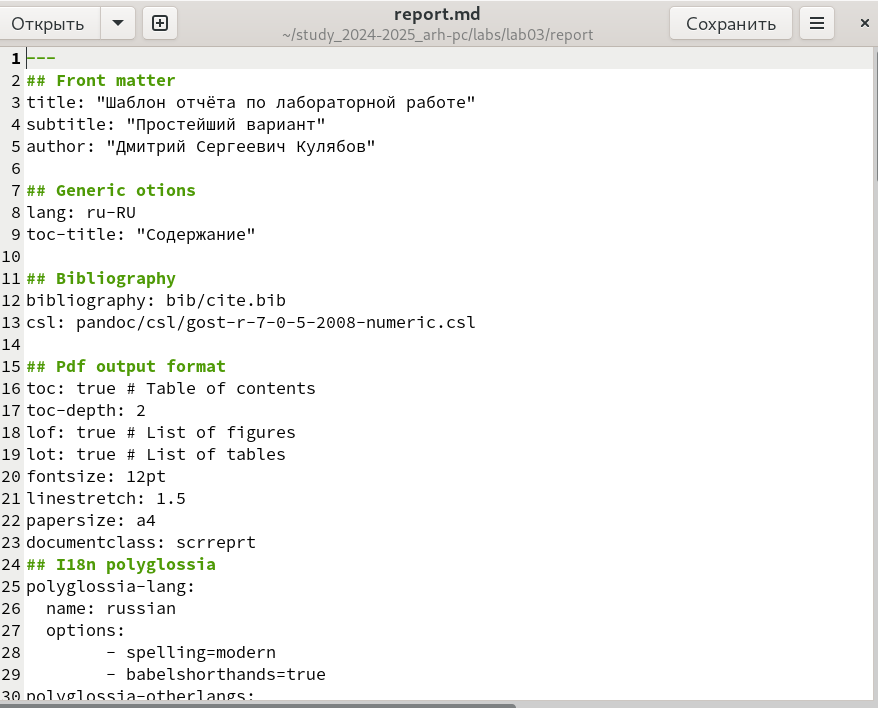

Посмотрим, что из себя представляет файл report.md и заполним его.
После заполнения отчёта прописываем команду make, чтобы скомпилировать готовый отчёт (Рис. 10)

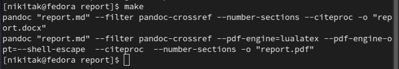

С помощью git отправим файлы лабораторной работы на Github. В качестве комментария укажем, что мы добавляем файлы для третьей лабораторной работы (Рис.11)

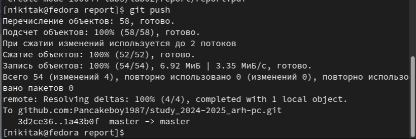

# Выполнение самостоятельной работы
В качестве самостоятельной работы нам необходимо в соответствующем каталоге сделать отчет по второй лабораторной работе в формате Markdown, сохранить файлы в том же формате, что и в основной части лабораторной работы, а затем загрузить на Github.

Для этого, перейдя в каталог второй лабораторной работы, откроем report.md и заполним по такому же принципу, используя снимки и текст из исходного файла.(рис.12-13)

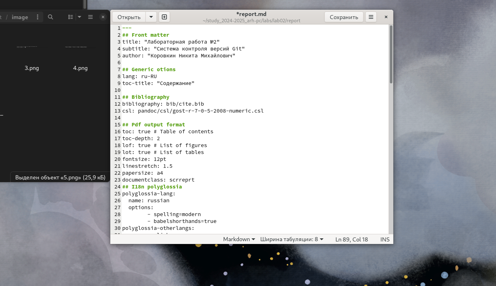

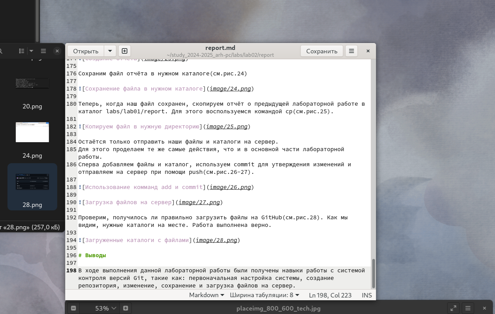

Теперь остается лишь скомпилировать файлы и затем загрузить их на сервер.(рис.14)

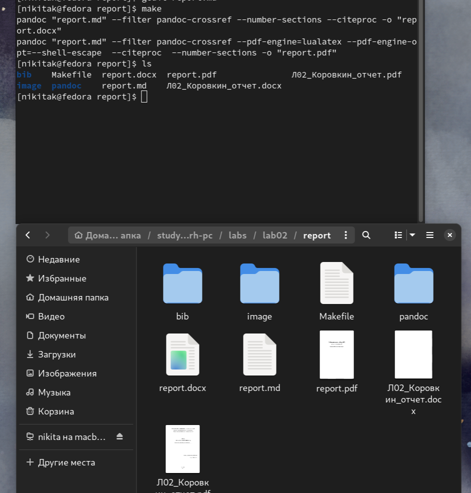

Файлы готовы, загрузим их на Github.(рис.15)

# Выводы

Благодаря выполнению данной лабораторной работы были получены навыки работы с языком разметки Markdown, и заполнены отчеты о двух лабораторных работах в трех разных форматах.
