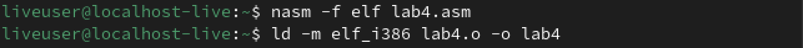
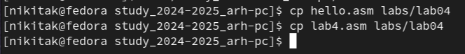

---
## Front matter
title: "Лабораторная работа №4"
subtitle: "Создание и процесс обработки программ на языке ассемблера NASM"
author: "Коровкин Никита Михайлович"

## Generic otions
lang: ru-RU
toc-title: "Содержание"

## Bibliography
bibliography: bib/cite.bib
csl: pandoc/csl/gost-r-7-0-5-2008-numeric.csl

## Pdf output format
toc: true # Table of contents
toc-depth: 2
lof: true # List of figures
lot: true # List of tables
fontsize: 12pt
linestretch: 1.5
papersize: a4
documentclass: scrreprt
## I18n polyglossia
polyglossia-lang:
  name: russian
  options:
	- spelling=modern
	- babelshorthands=true
polyglossia-otherlangs:
  name: english
## I18n babel
babel-lang: russian
babel-otherlangs: english
## Fonts
mainfont: IBM Plex Serif
romanfont: IBM Plex Serif
sansfont: IBM Plex Sans
monofont: IBM Plex Mono
mathfont: STIX Two Math
mainfontoptions: Ligatures=Common,Ligatures=TeX,Scale=0.94
romanfontoptions: Ligatures=Common,Ligatures=TeX,Scale=0.94
sansfontoptions: Ligatures=Common,Ligatures=TeX,Scale=MatchLowercase,Scale=0.94
monofontoptions: Scale=MatchLowercase,Scale=0.94,FakeStretch=0.9
mathfontoptions:
## Biblatex
biblatex: true
biblio-style: "gost-numeric"
biblatexoptions:
  - parentracker=true
  - backend=biber
  - hyperref=auto
  - language=auto
  - autolang=other*
  - citestyle=gost-numeric
## Pandoc-crossref LaTeX customization
figureTitle: "Рис."
tableTitle: "Таблица"
listingTitle: "Листинг"
lofTitle: "Список иллюстраций"
lotTitle: "Список таблиц"
lolTitle: "Листинги"
## Misc options
indent: true
header-includes:
  - \usepackage{indentfirst}
  - \usepackage{float} # keep figures where there are in the text
  - \floatplacement{figure}{H} # keep figures where there are in the text
---

# Цель работы

Научиться писать базовые программы на языке ассемблера NASM, компилировать их в объектные файлы и собирать из них исполняемые программы с помощью компановщика.

# Выполнение лабораторной работы
Сперва перейдем в нужную директорию.(рис.1)

Теперь создадим файл нужного формата.(рис.2)

Откроем созданный нами файл.(рис.3)

Отредактируем файл, вставив необходимый код.(рис.4)

Отредактироовав, скомпилируем код, Но для начала превратим файл в объектный при помощи Nasm.(рис.5)

Проверим,все ли мы сделали правильно с помощью ls.(рис.5)

Теперь воспользуемся полным вариантом команды  Nasm, где укажем,что файл hello.asm должен быть скомпилирован в файл с названием obj.o (рис.6)

Дальше воспользуемся компановщиком, который соберет объектный файл.(рис.7)

![Используем команду и делаем проверку(image/7.png)

Пропишем команду для создания исполняемого файла.(рис.8)

Затем соберем файл obj.o в файл main.(рис.9)

Теперь запустим файл hello, написав ./ и название файла. Посмотрим, работает ли команда.(рис.10)

Мы получили  Hello world, значит вся работа сделана правильно.

# Выполнение самостоятельной работы

Теперь сделаем копиию файла hello.asm  и назовем lab4.asm.(рис.11)

Так же откроем его с помощью gedit.(рис.12)

Теперь в самом редакторе заменим Hello world  на имя и фамилию.(рис.13)

Затем по тому же принципу скомпилируем и соберем файл.(рис.14)

Пропишем команду, чтобы запустить файл и проверить его работу.(рис.15)

Все работает верно. Остается только скопировать оба файла и перенести в нужный каталог(рис.16)

Загрузим файлы на сервер.Самостоятельная работа сделана верно.(рис.17)

# Выводы

В ходе выполнения лабораторной работы мы получили знания о том, как работает алгоритм создания исполняемого файла из кода на ассемблере, а также приобрели  навыки работы с языком nasm.
