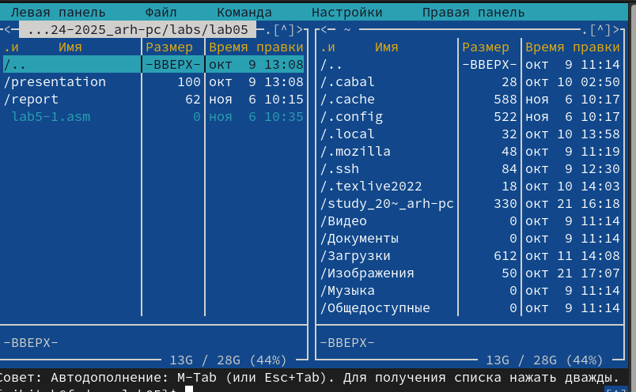
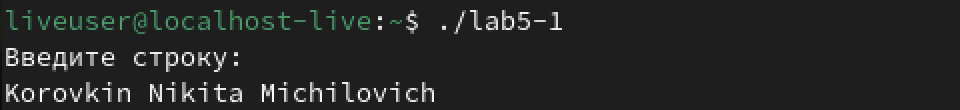
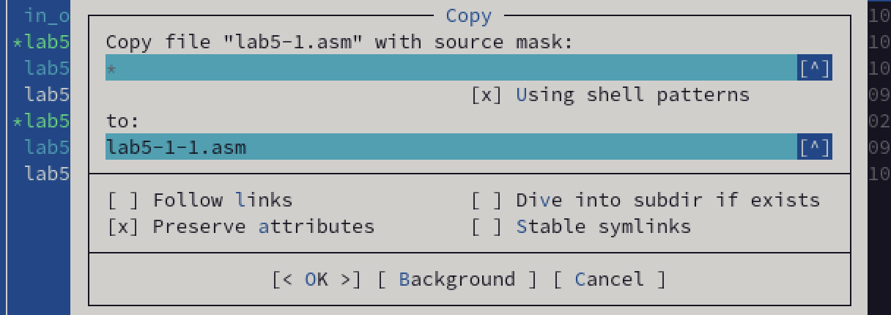

---
## Front matter
title: "Лабораторная работа №5"
subtitle: "Основы работы с Midnight Commander (mc). Структура программы на языке ассемблера NASM. Системные вызовы в ОС GNU Linux"
author: "Коровкин Никита Михайлович"

## Generic otions
lang: ru-RU
toc-title: "Содержание"

## Bibliography
bibliography: bib/cite.bib
csl: pandoc/csl/gost-r-7-0-5-2008-numeric.csl

## Pdf output format
toc: true # Table of contents
toc-depth: 2
lof: true # List of figures
lot: true # List of tables
fontsize: 12pt
linestretch: 1.5
papersize: a4
documentclass: scrreprt
## I18n polyglossia
polyglossia-lang:
  name: russian
  options:
	- spelling=modern
	- babelshorthands=true
polyglossia-otherlangs:
  name: english
## I18n babel
babel-lang: russian
babel-otherlangs: english
## Fonts
mainfont: IBM Plex Serif
romanfont: IBM Plex Serif
sansfont: IBM Plex Sans
monofont: IBM Plex Mono
mathfont: STIX Two Math
mainfontoptions: Ligatures=Common,Ligatures=TeX,Scale=0.94
romanfontoptions: Ligatures=Common,Ligatures=TeX,Scale=0.94
sansfontoptions: Ligatures=Common,Ligatures=TeX,Scale=MatchLowercase,Scale=0.94
monofontoptions: Scale=MatchLowercase,Scale=0.94,FakeStretch=0.9
mathfontoptions:
## Biblatex
biblatex: true
biblio-style: "gost-numeric"
biblatexoptions:
  - parentracker=true
  - backend=biber
  - hyperref=auto
  - language=auto
  - autolang=other*
  - citestyle=gost-numeric
## Pandoc-crossref LaTeX customization
figureTitle: "Рис."
tableTitle: "Таблица"
listingTitle: "Листинг"
lofTitle: "Список иллюстраций"
lotTitle: "Список таблиц"
lolTitle: "Листинги"
## Misc options
indent: true
header-includes:
  - \usepackage{indentfirst}
  - \usepackage{float} # keep figures where there are in the text
  - \floatplacement{figure}{H} # keep figures where there are in the text
---

# Цель работы

Ознакомиться с программой Midnight commander и освоить написание программ на языке ассемблера с помощью инструкций mov и int

# Выполнение лабораторной работы

Для начала выполнения лабораторной работы нам нужно открыть Midnight commander с помощью команды mc (Рис.1):

Перед нами появится такой интерфейс (Рис.2)

Создадим файл lab5-1.asm в нужной директории. (Рис.3)

Откроем созданный файл и отредактируем его, вставив туда нужный код. (Рис.4)

Сохранив его, скомпилируем файл. (Рис.5)

Теперь соберем файл. (Рис.6)

После этого запустим получившийся исполняемый файл. (Рис. 7):

Запишем ФИО в строку и нажмем  Enter.
Ничего не произойдет. Тогда скачаем файл in_out.asm и откроем  Midnight Commander. (Рис.8)

Скопируем файл в нужную папку, с которой мы работаем. (Рис.9)

Теперь скопируем lab5-1 в ту же папку, назвав его lab5-2. (Рис.10)

Откроем новый файл и отредактируем его, вставив туда следующий код. (Рис. 11)

Теперь проделаем то же самое, что и с первым файлом, и запустим его. (Рис. 12)

Он работает также, как и файл lab5-1, но использует для работы сторонний файл. Теперь отредактируем код еще раз и заменим sprintFL на sprint. Запускаем код. (Рис.13)

Нетрудно заметить, что теперь нет переноса на следующую строку. В этом и отлиичие команды sprintLF от sprint. Первая добавляет перенос после текста, а вторая нет.

# Выполнение самостоятельной работы
Теперь еще раз скопируем изначальный файл. (Рис.14)

Нам нужно сделать так,чтобы код выводил полученную на вводе строку.
Для этого перед системным вызовом exit нам нужно вставить часть кода с вызовом write. Нам необходимо переместить адрес строки buf1 в ecx и размер строки buf1 (80) в edx. (Рис.15)

Запускаем файл и проверяем работоспособность. (Рис.16)

Теперь создадим копию файла lab5-2.asm и сделаем так, чтобы  код тоже выводил тот же текст, что получает на ввод.
Для этого перед последней строкой добавим строчу, которая записывает в eax адрес buf1 и  строку,  вызывающую подпрограмму sprintLF. (Рис.17)

Скомпилируем файл и запустим код.(Рис.18)

Программа выполняется верно, следовательно, самостоятельная работа выполнена правильно.

# Выводы

В ходе выполнения данной лабораторной работы были получены навыки работы с Midnight commander и навыки создания программ ввода и вывода на ассемблере.
