---
## Front matter
title: "Лабораторная работа №6"
subtitle: "Арифметические операции в NASM"
author: "Коровкин Никита Михайлович"

## Generic otions
lang: ru-RU
toc-title: "Содержание"

## Bibliography
bibliography: bib/cite.bib
csl: pandoc/csl/gost-r-7-0-5-2008-numeric.csl

## Pdf output format
toc: true # Table of contents
toc-depth: 2
lof: true # List of figures
lot: true # List of tables
fontsize: 12pt
linestretch: 1.5
papersize: a4
documentclass: scrreprt
## I18n polyglossia
polyglossia-lang:
  name: russian
  options:
	- spelling=modern
	- babelshorthands=true
polyglossia-otherlangs:
  name: english
## I18n babel
babel-lang: russian
babel-otherlangs: english
## Fonts
mainfont: IBM Plex Serif
romanfont: IBM Plex Serif
sansfont: IBM Plex Sans
monofont: IBM Plex Mono
mathfont: STIX Two Math
mainfontoptions: Ligatures=Common,Ligatures=TeX,Scale=0.94
romanfontoptions: Ligatures=Common,Ligatures=TeX,Scale=0.94
sansfontoptions: Ligatures=Common,Ligatures=TeX,Scale=MatchLowercase,Scale=0.94
monofontoptions: Scale=MatchLowercase,Scale=0.94,FakeStretch=0.9
mathfontoptions:
## Biblatex
biblatex: true
biblio-style: "gost-numeric"
biblatexoptions:
  - parentracker=true
  - backend=biber
  - hyperref=auto
  - language=auto
  - autolang=other*
  - citestyle=gost-numeric
## Pandoc-crossref LaTeX customization
figureTitle: "Рис."
tableTitle: "Таблица"
listingTitle: "Листинг"
lofTitle: "Список иллюстраций"
lotTitle: "Список таблиц"
lolTitle: "Листинги"
## Misc options
indent: true
header-includes:
  - \usepackage{indentfirst}
  - \usepackage{float} # keep figures where there are in the text
  - \floatplacement{figure}{H} # keep figures where there are in the text
---

# Цель работы

Познакомиться с базовыми инструкциями языка Ассемблер, отвечающими за основные арифметические операции.

# Выполнение лабораторной работы
В первую очередь переместимся в папку для 6-й лабораторной работы и создадим первый файл.(рис.1)

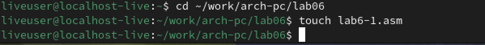

Запустим Midnight Commander и откроем наш файл.(рис.2)

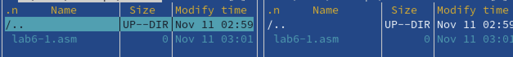

Открыв файл, вставляем первый код из листинга 6.1.(рис.3)

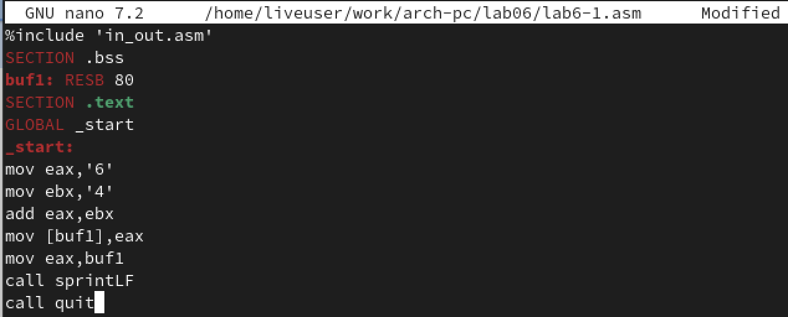

После этого добавим в нашу папку файл in_out.asm, так как без него наш код работать не будет.(рис.4)

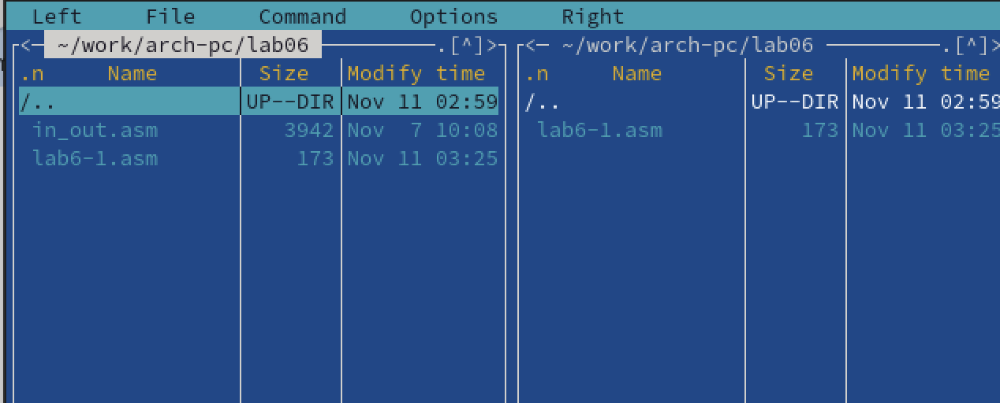

Теперь запустим код из нашего перового файла. 
На выходе мы получим j. Это неправильный вывод, так как изначально мы складывали цифры.

Чтобы получить на выходе верный результат, отредактируем код, убрав кавычки.(рис.6)

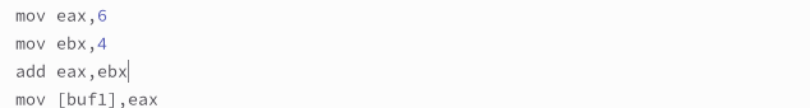

Теперь запустим код еще раз. НА выходе мы ничего не видим, однако это не так.
По таблице ASCII под 10 номером обозначен перевод строки.
Наш код выводит не число 10, а символ с данным номером.(рис.7)

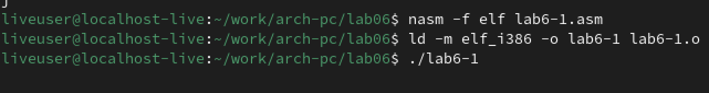

Создадим второй файл - lab6-2.nasm.(рис.8)

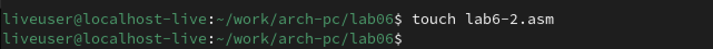

Вставим в него код из листинга 6.2.(рис.9)

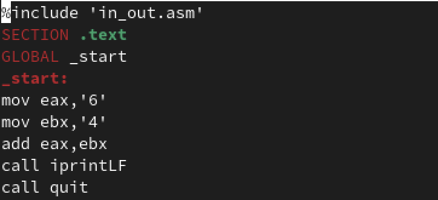

Запускаем код и на выходе получаем 106.(рис.10)

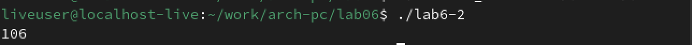

Мы получили 106, так как цифры были в кавычках и мы получили сложение их номеров.
54 и 52 в сумме дают 106. Тогда уберем кавычки и проверим программу.(рис.11)

Все выводится верно. Теперь отредактируем код еще раз. 
Заменим в коде iprintLF на iprint, чтобы узнать отличие.(рис.12)

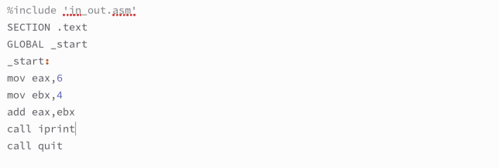

Теперь запустим файл.(рис.13)

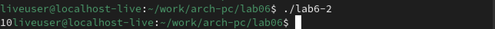

Как мы видим, после замены число выводится без переноса строки.

Создадим теперь третий файл.(рис.14)

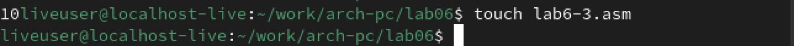

Вставим в него код из листинга 6.3.(рис.15)

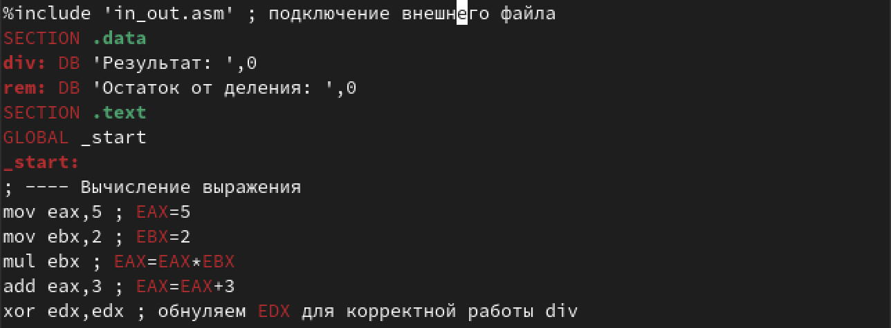

Код должен выводить значение функции (5*2+3)/3. Запустим код.
На выходе у нас ответ 4 и остаток от деления 1.(рис.16)

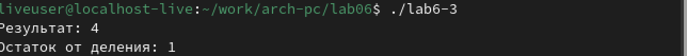

Наш результат совпадает с результатом, указанным в лабораторной работе.
Теперь изменим файл так, чтобы он вычислял значение выражения (4*6+2)/5. 
Запустим код и проверим, совпадет ли результат.(рис.17)

Результат действительно совпадает.

Теперь нам необходимо создать файл, который будет высчитывать вариант задания для самостоятельной работы.
Вставляем необходимый код в файл.(рис.18)

Теперь запустим код. Введем туда номер студенческого билета.(рис.19)

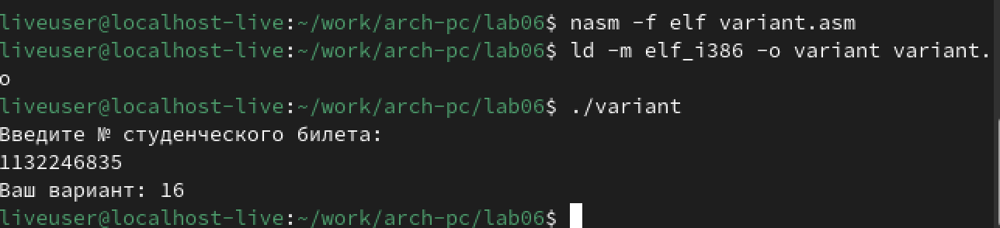

Мы получили на выходе 16. Таким будет номер нашего варианта.

Разберем то, как работает код, ответив на следующие вопросы.

1. Какие строки листинга 6.4 отвечают за вывод на экран сообщения ‘Ваш вариант:’?

За вывод сообщения отвечает call sprint и строка mov eax,rem,  перемещающая строку с фразой в регистр eax, из которого мы считываем данные для вывода

2. Для чего используется следующие инструкции?

mov ecx, x

mov edx, 80

call sread

Данные строки используются для записи данных в переменную х.

3. Для чего используется инструкция “call atoi”?

Инструкция используется для преобразования ASCII кода в число.

4. Какие строки листинга 6.4 отвечают за вычисления варианта?

div ebx и inc edx

Первая отвечает за деление, вторая - прибавляет единицу

5. В какой регистр записывается остаток от деления при выполнении инструкции “div ebx”?

В регистр edx

6. Для чего используется инструкция “inc edx”?

Оно увеличивает значение на единицу

7. Какие строки листинга 6.4 отвечают за вывод на экран результата вычислений?

mov eax,edx и call iprintLF

Первая строка переносит значение регистра edx в eax, а вторая выводит значение регистра eax 

# Выполнение самостоятельной работы

В качестве самостоятельной работы решим задание из 16-го варианта.
Это уравнение (10𝑥 − 5)^2, где х1 = 1, х2 = 3.

Для начала создадим файл для вычисления.(рис.20)

Откроем файл и запишем туда код для вычисления.(рис.21)

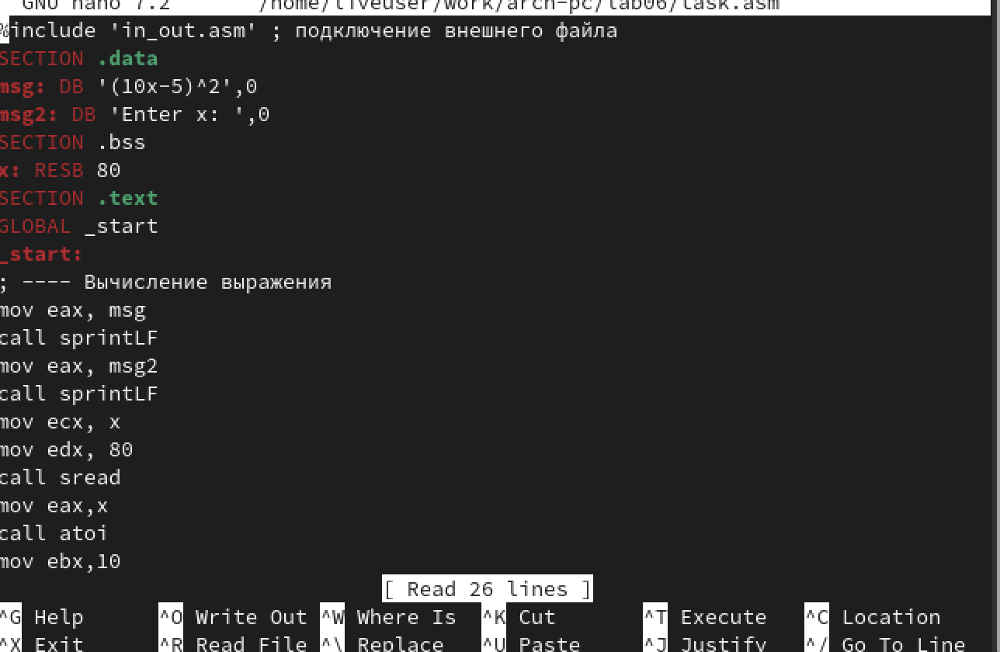

Первые 4 строки отвечают за вывод сообщения на экран.

Следующие 3 строки мы используем для ввода значения переменной х.

mov eax, x и  call atoi отвеча.т за преобразование ASCII кода в число.

Затем умножаем х на 10 и вычитаем 5.
Полученное число умножаем на само себя, чтобы возвести в квадрат.

В конце выводим результат и завершаем программу.

Запустим код и проверим результат.(рис.22)

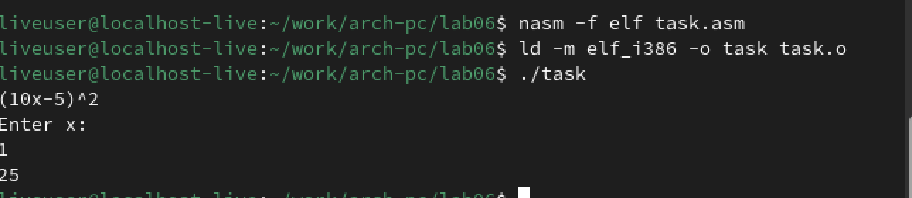

Введя 1, получаем 25. Посчитав вручную, мы понимаем, что ответ верный.

Запусти код второй раз, введя 3.(рис.23)

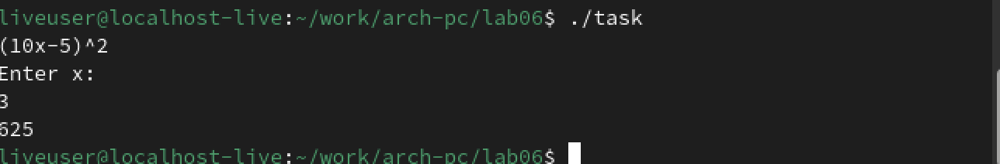

Ответ 625, значит код написан верно.

# Выводы

В ходе выполнения лабораторной работы мы получили знания о видах и работе арифметических операций на языке Ассемблера.
Также мы самостоятельно написали программу, закрепив знания.

