---
## Front matter
title: "Лабораторная работа №7"
subtitle: "Команды безусловного и условного переходов в Nasm. Программирование ветвлений"
author: "Коровкин Никита Михайлович"

## Generic otions
lang: ru-RU
toc-title: "Содержание"

## Bibliography
bibliography: bib/cite.bib
csl: pandoc/csl/gost-r-7-0-5-2008-numeric.csl

## Pdf output format
toc: true # Table of contents
toc-depth: 2
lof: true # List of figures
lot: true # List of tables
fontsize: 12pt
linestretch: 1.5
papersize: a4
documentclass: scrreprt
## I18n polyglossia
polyglossia-lang:
  name: russian
  options:
	- spelling=modern
	- babelshorthands=true
polyglossia-otherlangs:
  name: english
## I18n babel
babel-lang: russian
babel-otherlangs: english
## Fonts
mainfont: IBM Plex Serif
romanfont: IBM Plex Serif
sansfont: IBM Plex Sans
monofont: IBM Plex Mono
mathfont: STIX Two Math
mainfontoptions: Ligatures=Common,Ligatures=TeX,Scale=0.94
romanfontoptions: Ligatures=Common,Ligatures=TeX,Scale=0.94
sansfontoptions: Ligatures=Common,Ligatures=TeX,Scale=MatchLowercase,Scale=0.94
monofontoptions: Scale=MatchLowercase,Scale=0.94,FakeStretch=0.9
mathfontoptions:
## Biblatex
biblatex: true
biblio-style: "gost-numeric"
biblatexoptions:
  - parentracker=true
  - backend=biber
  - hyperref=auto
  - language=auto
  - autolang=other*
  - citestyle=gost-numeric
## Pandoc-crossref LaTeX customization
figureTitle: "Рис."
tableTitle: "Таблица"
listingTitle: "Листинг"
lofTitle: "Список иллюстраций"
lotTitle: "Список таблиц"
lolTitle: "Листинги"
## Misc options
indent: true
header-includes:
  - \usepackage{indentfirst}
  - \usepackage{float} # keep figures where there are in the text
  - \floatplacement{figure}{H} # keep figures where there are in the text
---

# Цель работы

Понять принцип работы условных и безусловных переходов в Ассемблере и научиться писать программы с командами, отвечающими за переходы. Научиться работать с файлами листинга и уметь их читать.

# Выполнение лабораторной работы

Для начала нам необходимо создать рабочую папку lab07 и файл lab7-1.asm (рис.1):

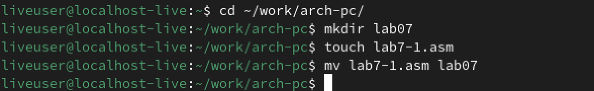

Создав файл, вставим туда код из листинга.(рис.2)

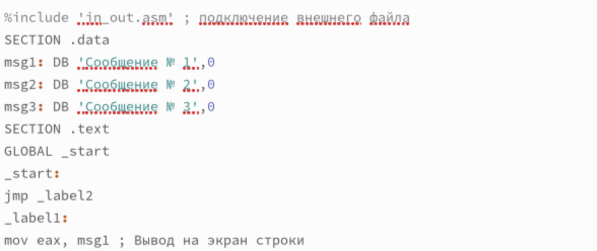

После этого перенесем в нужную папку файл in_out.asm, чтобы код работал.(рис.3)

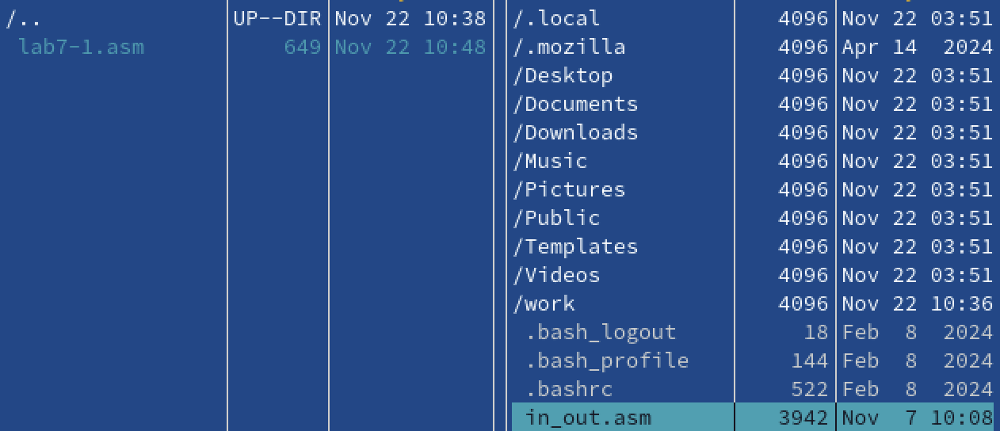

Соберем нашу программу и запустим ее.(рис.4)

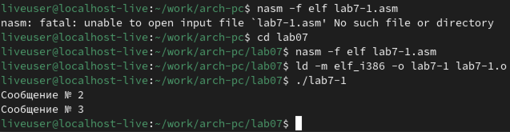

После этого отредактируем файл, как это сделано во втором листинге.(рис.5)

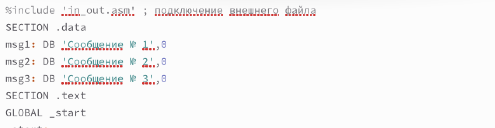

Снова запустим наш код.(рис.6)

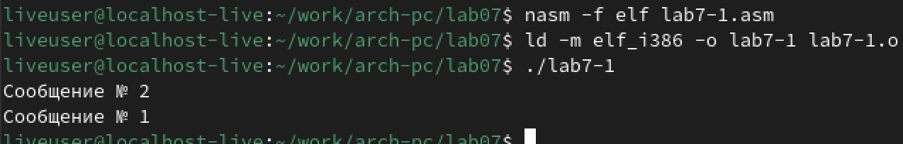

После этого перепишем код, чтобы он выводил сообщения в обратном порядке - от 3 сообщения к первому.(рис.7)

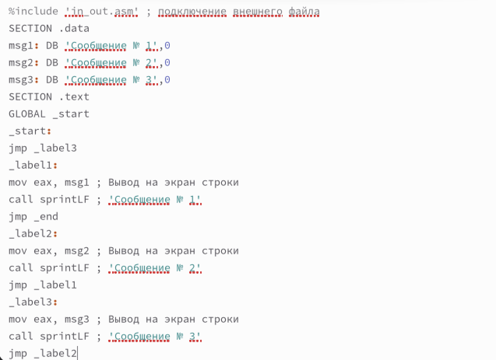

Проверим и запустим код.(рис.8)

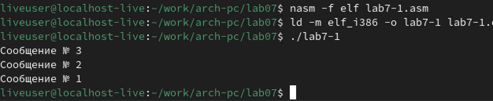

Код работает верно.

Теперь создадим второй файл.(рис.9)

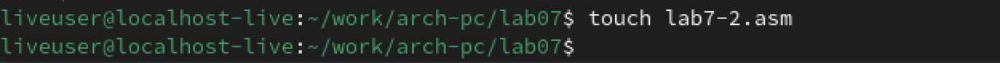

Вставим туда код из третьего листинга и запустим файл, проверяя, как он работает.(рис.10)

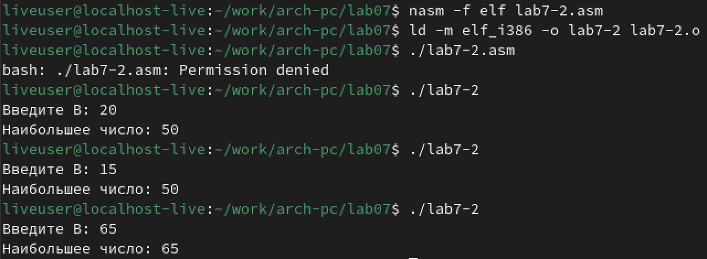

Теперь создадим файл листинга при сборке файла.(рис.11)

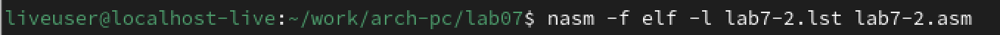

Откроем файл.(рис.12)

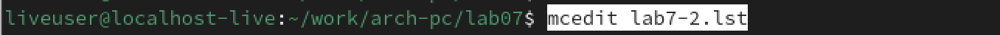

Перед нами появляется такое окно.(рис.13)

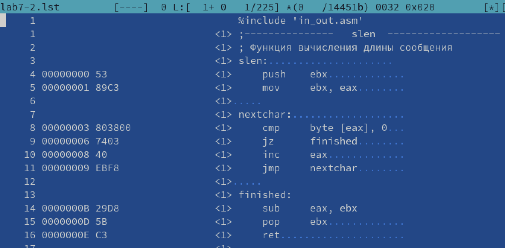

Программа будет находиться ниже.(рис.14)

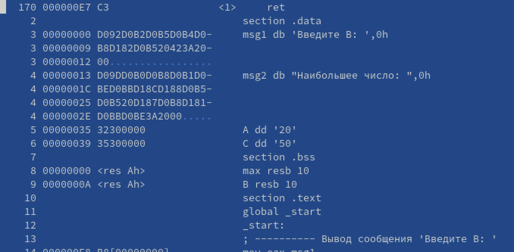

Попробуем разобрать несколько строк кода.

  1) Строка 3 отвечает за содержимое сообщения.

  2) Cтрока 11 отвечает за начало основной рабочей части кода

  3) 14 строка отправляет сообщение в нужный регистр

Теперь допустим ошибку в нашем коде.(рис.15)

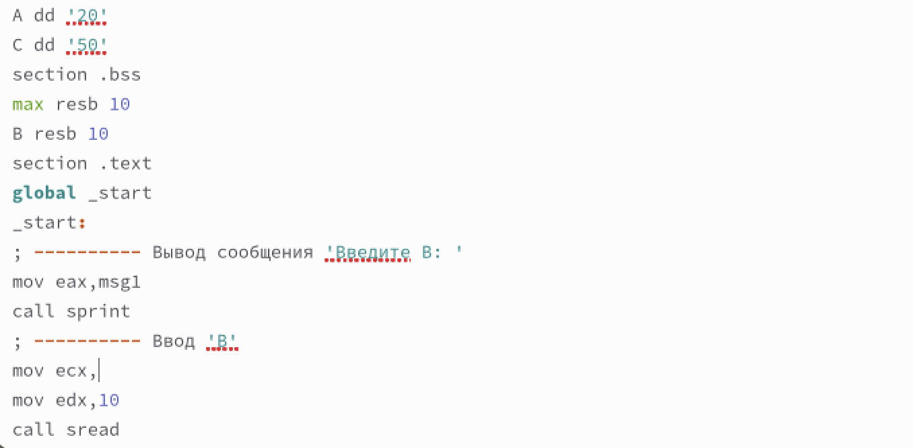

Создадим файл листинга  еще раз.(рис.16)

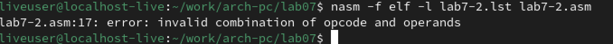

У нас возникает ошибка.
Откроем файл и найдем ошибку.(рис.17)

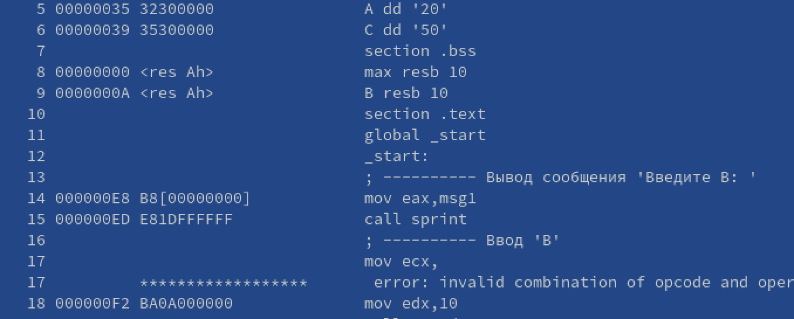

Как можно заметить, в листинге прописана ошибка.

#Выполнение Самостоятельной работы

Для начала создадим первый файл.(рис.18)

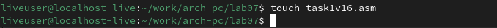

Запишем в него код, который будет находить наименьшее число среди трех. Вариант выполняемого задания - 16.(рис.19)

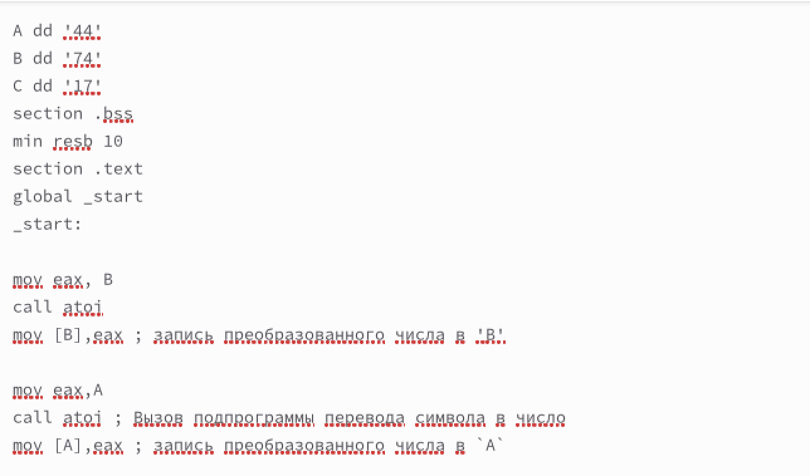

Запустим файл.  На выходе получаем число 17.
Это верный ответ.(рис.20)

Теперь создадим второй файл и запишем туда следующий код.(рис.21-23)

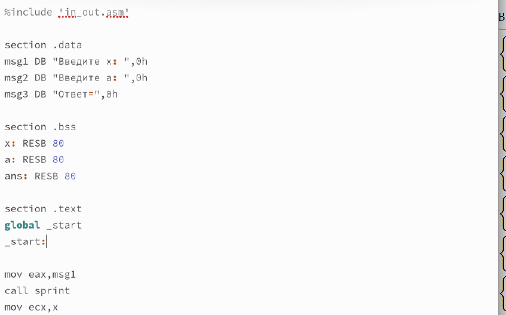
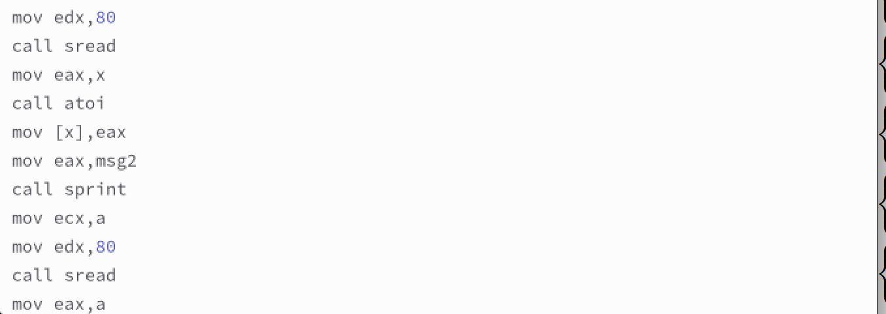
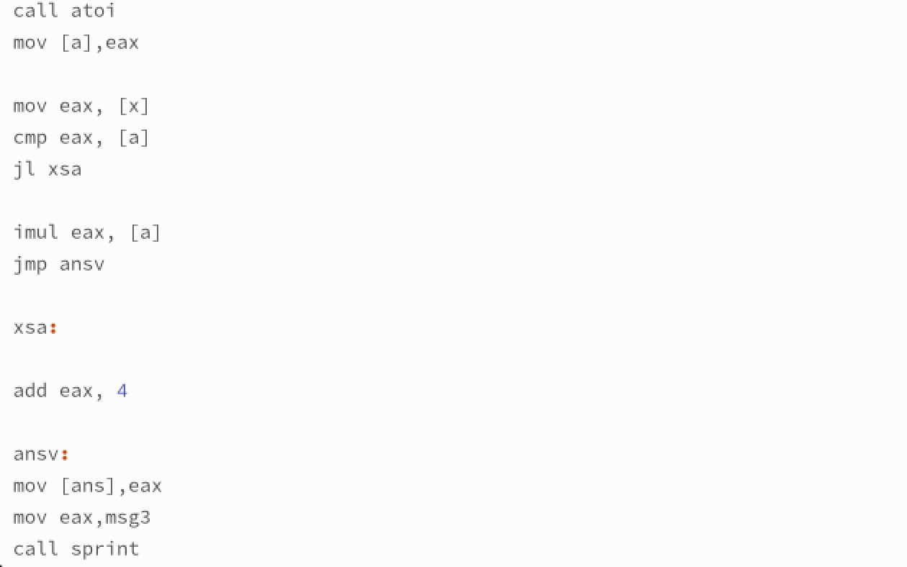

Запустим файл и попробуем две пары чисел.(рис.24)

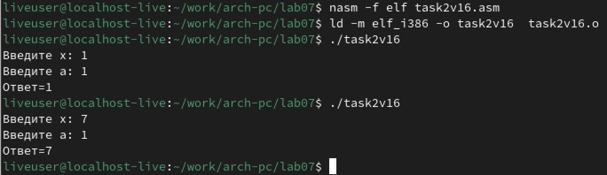

Код работает верно. Самостоятельная работа выполнена правильно.

# Выводы

В ходе выполнения лабораторной работы были получены навыки работы с командами условных и безусловных переходов и написаны программы для закрепления материала

