---
## Front matter
title: "Лабораторная работа №8"
subtitle: "Программирование цикла. Обработка аргументов командной строки"
author: "Коровкин Никита Михайлович"

## Generic otions
lang: ru-RU
toc-title: "Содержание"

## Bibliography
bibliography: bib/cite.bib
csl: pandoc/csl/gost-r-7-0-5-2008-numeric.csl

## Pdf output format
toc: true # Table of contents
toc-depth: 2
lof: true # List of figures
lot: true # List of tables
fontsize: 12pt
linestretch: 1.5
papersize: a4
documentclass: scrreprt
## I18n polyglossia
polyglossia-lang:
  name: russian
  options:
	- spelling=modern
	- babelshorthands=true
polyglossia-otherlangs:
  name: english
## I18n babel
babel-lang: russian
babel-otherlangs: english
## Fonts
mainfont: IBM Plex Serif
romanfont: IBM Plex Serif
sansfont: IBM Plex Sans
monofont: IBM Plex Mono
mathfont: STIX Two Math
mainfontoptions: Ligatures=Common,Ligatures=TeX,Scale=0.94
romanfontoptions: Ligatures=Common,Ligatures=TeX,Scale=0.94
sansfontoptions: Ligatures=Common,Ligatures=TeX,Scale=MatchLowercase,Scale=0.94
monofontoptions: Scale=MatchLowercase,Scale=0.94,FakeStretch=0.9
mathfontoptions:
## Biblatex
biblatex: true
biblio-style: "gost-numeric"
biblatexoptions:
  - parentracker=true
  - backend=biber
  - hyperref=auto
  - language=auto
  - autolang=other*
  - citestyle=gost-numeric
## Pandoc-crossref LaTeX customization
figureTitle: "Рис."
tableTitle: "Таблица"
listingTitle: "Листинг"
lofTitle: "Список иллюстраций"
lotTitle: "Список таблиц"
lolTitle: "Листинги"
## Misc options
indent: true
header-includes:
  - \usepackage{indentfirst}
  - \usepackage{float} # keep figures where there are in the text
  - \floatplacement{figure}{H} # keep figures where there are in the text
---

# Цель работы

Научиться работать с циклами на языке Ассемблера, а также научиться обрабатывать аргументы командной строки

# Выполнение лабораторной работы

Для начала создадим новую папку для 8-й лабораторной работы и первый файл.(рис.1)

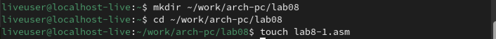

Запустив Midnight commander, вставляем код из первого листинга.(рис.2)

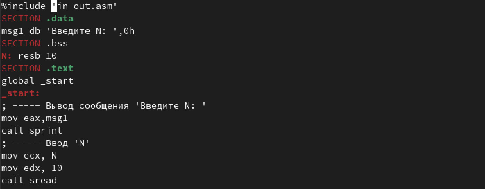

Код должен запускать цикл и выводить каждую итерацию число, которое будет на единицу меньше предыдущего. 
Чтобы он работал перенесем файл in_out.asm из папки предыдущей лабораторной работы(рис.3)

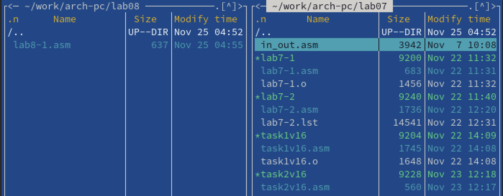

Запустим код и посмотрим результат(рис.4)

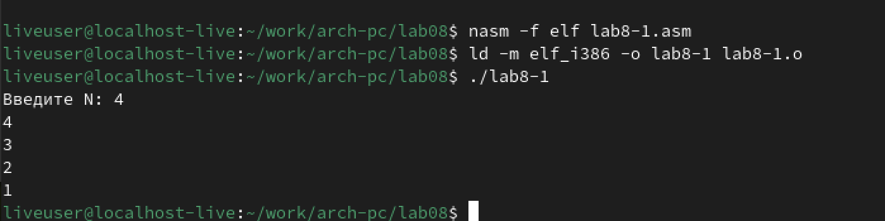

Видно, что программа выводит числа от N до единицы.

Теперь изменим код, чтобы в цикле отнималась единица у регистра ecx.(рис.5)

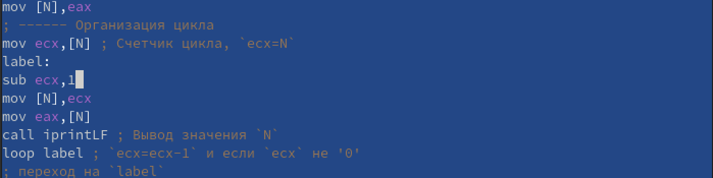

Соберем файл еще раз и при запуске тоже введем 4.(рис.6)

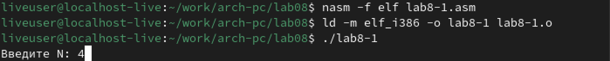

На выходе мы получаем бесконечный вывод, а значит количество проходов не совпадает с введенным значением.(рис.7)

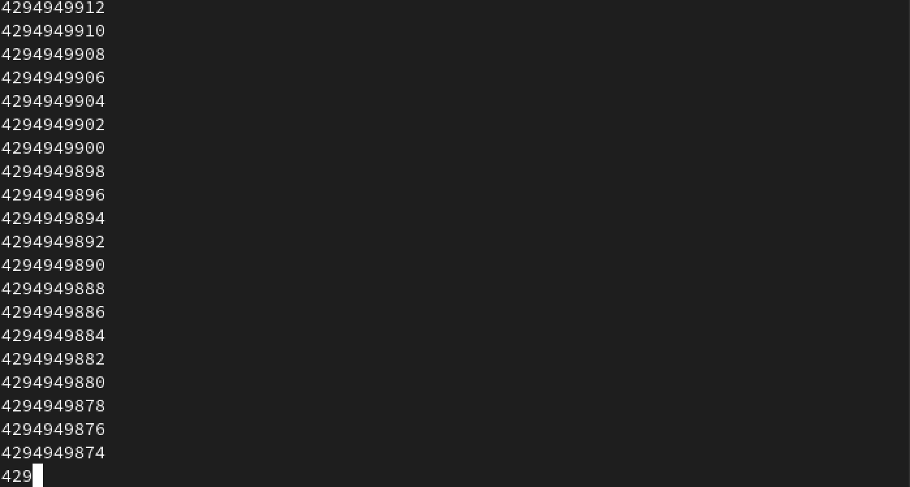

Тогда изменим программу так, чтобы она сохраняла значение регистра ecx в стек.(рис.8)

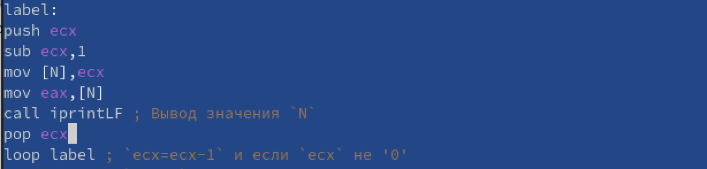

Запустим код еще раз. На этот раз вывод правильный, значит код написан верно.(рис.9)

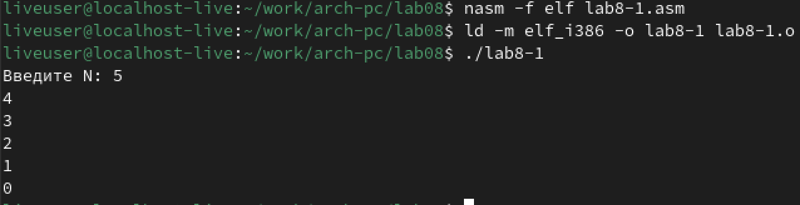

Теперь создадим второй файл.(рис.10)

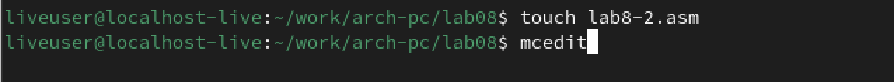

Вставим туда код из второго листинга.(рис.11)

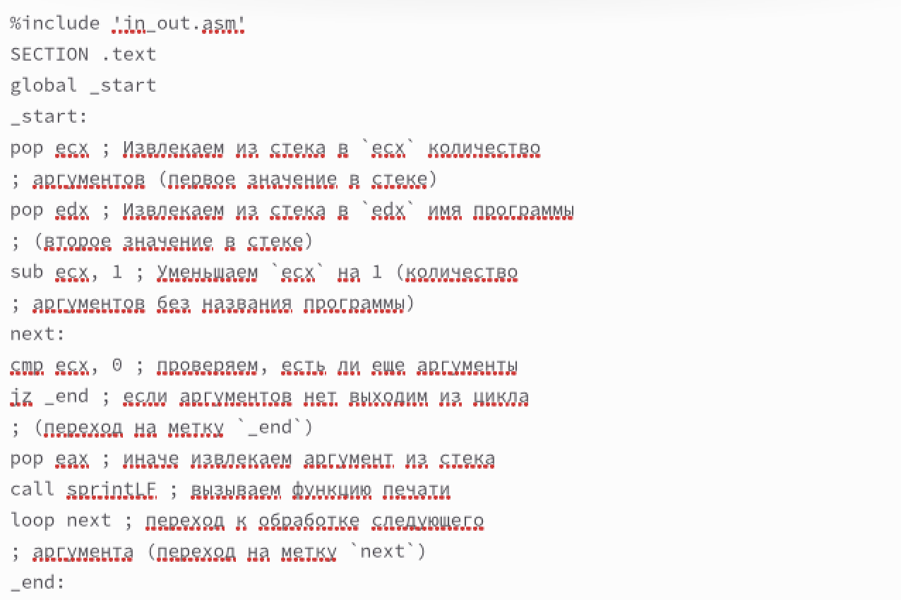

Теперь запустим программу и дадим при запуске 3 аргумента.
На выходе мы получим их же.
Программа выводит их по порядку.(рис.12)

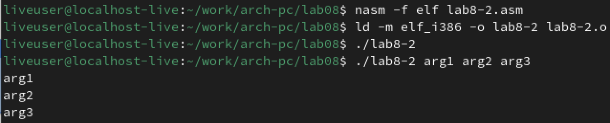

Теперь создадим 3-й файл.(рис.13)

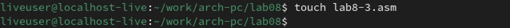

Вставляем туда код из третьего листинга.(рис.14)

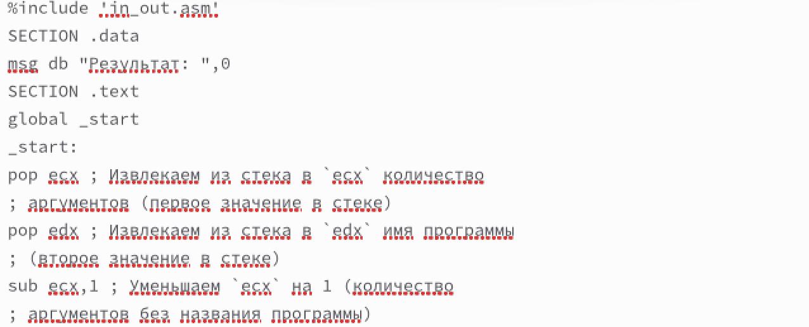

Теперь снова соберем файл.
При запуске введем несколько чисел, которые программа должна сложить.(рис.15)

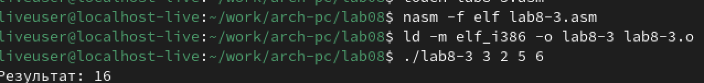

Все вывелось верно.
Теперь попробуем немного отредактировать код, чтобы числа перемножались.(рис.16)

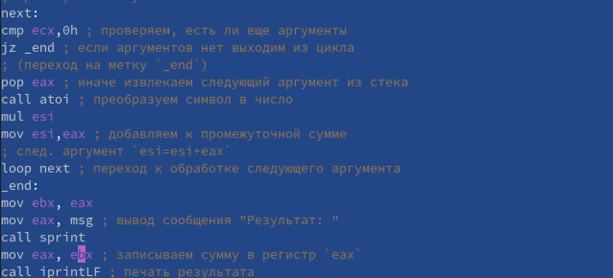

Теперь запустим файл еще раз.
как мы видим, все числа перемножились и программа вывела верный ответ(рис.17)

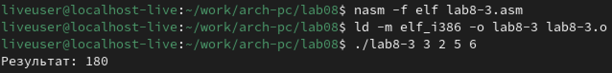

#Выполнение самостоятельной работы

Для начала создадим файл, где буем писать код.(рис.18)

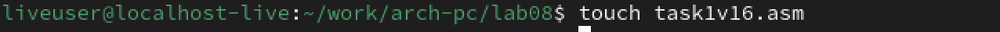

Далее откроем файл.(рис.19)

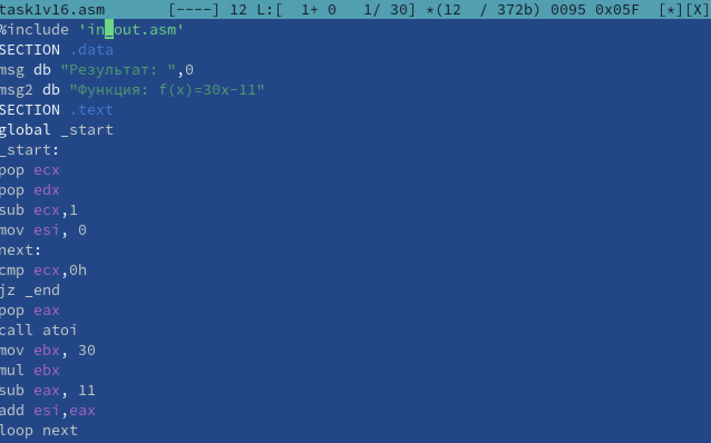

Запишем код, который будет вычислять функцию из варианта с заданными аргументами 16 и затем сложит ответы при всех аргументах.(рис.20-21)

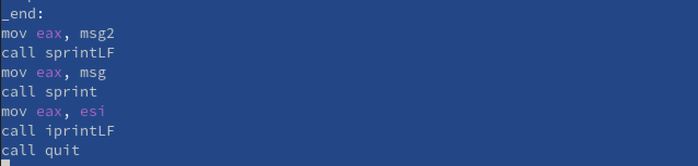

Опишем те строки кода, которые могут  вызывать вопросы:

pop ecx - здесь из регистра достаем количество аргументов в стеке

esi отвечает за хранение промежуточных сумм.

cmp ecx необходимо для проверки, есть ли еще аргументы на входе.

Теперь запустим код и введем несколько разных аргументов для проверки.(рис.22)

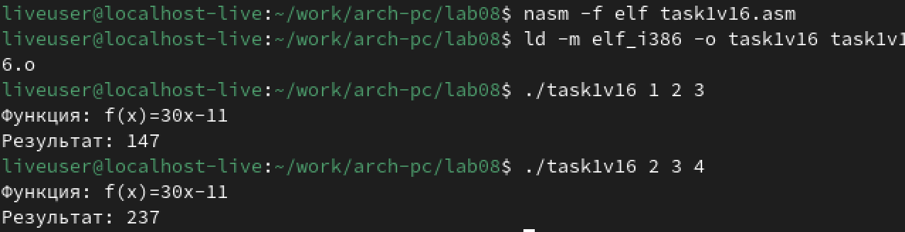

Код работает правильно, значит самостоятельная работа выполнена верно.

# Выводы

В ходе выполнения данной лабораторной работы были получены знания о циклах на языке ассемблера и получены навыки о работе с ними.

