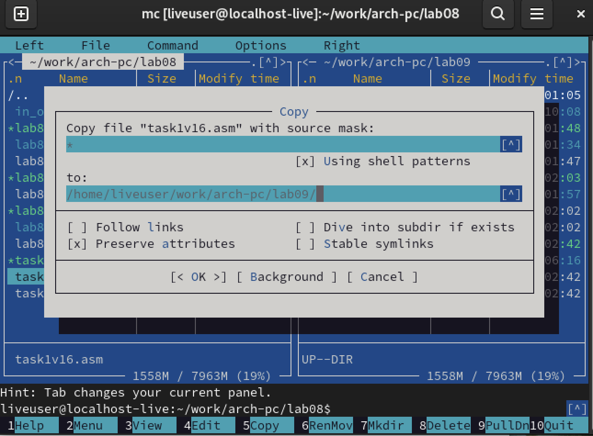

---
## Front matter
title: "Лабораторная работа №9"
subtitle: "Понятие подпрограммы. Отладчик GDB"
author: "Коровкин Никита  Михайлович"

## Generic otions
lang: ru-RU
toc-title: "Содержание"

## Bibliography
bibliography: bib/cite.bib
csl: pandoc/csl/gost-r-7-0-5-2008-numeric.csl

## Pdf output format
toc: true # Table of contents
toc-depth: 2
lof: true # List of figures
lot: true # List of tables
fontsize: 12pt
linestretch: 1.5
papersize: a4
documentclass: scrreprt
## I18n polyglossia
polyglossia-lang:
  name: russian
  options:
	- spelling=modern
	- babelshorthands=true
polyglossia-otherlangs:
  name: english
## I18n babel
babel-lang: russian
babel-otherlangs: english
## Fonts
mainfont: IBM Plex Serif
romanfont: IBM Plex Serif
sansfont: IBM Plex Sans
monofont: IBM Plex Mono
mathfont: STIX Two Math
mainfontoptions: Ligatures=Common,Ligatures=TeX,Scale=0.94
romanfontoptions: Ligatures=Common,Ligatures=TeX,Scale=0.94
sansfontoptions: Ligatures=Common,Ligatures=TeX,Scale=MatchLowercase,Scale=0.94
monofontoptions: Scale=MatchLowercase,Scale=0.94,FakeStretch=0.9
mathfontoptions:
## Biblatex
biblatex: true
biblio-style: "gost-numeric"
biblatexoptions:
  - parentracker=true
  - backend=biber
  - hyperref=auto
  - language=auto
  - autolang=other*
  - citestyle=gost-numeric
## Pandoc-crossref LaTeX customization
figureTitle: "Рис."
tableTitle: "Таблица"
listingTitle: "Листинг"
lofTitle: "Список иллюстраций"
lotTitle: "Список таблиц"
lolTitle: "Листинги"
## Misc options
indent: true
header-includes:
  - \usepackage{indentfirst}
  - \usepackage{float} # keep figures where there are in the text
  - \floatplacement{figure}{H} # keep figures where there are in the text
---

# Цель работы

Ознакомиться с понятием подпрограмм в Ассемблере и научиться использовать подпрограммы на практике. Ознакомиться с отладчиком gdb и научиться использовать его

                                                   |

# Выполнение лабораторной работы

Сперва создадим рабочую директорию и первый файл: с которым мы будем работать.(рис.1)

Далее подключим in_out.asm, перенеся его из папки прошлой лабораторной работы.(рис.2)

Откроем файл и вставим код из первого листинга.(рис.3)

Теперь соберем файл и запустим его.(рис.4)

Затем изменим файл, чтобы в подпрограмме была ещё одна подпрограмма, вычисляющая значение g(x), которая будет передавать значение в первую подпрограмму, которая бы уже вычислила значение f(g(x)).(рис.5)

Запустим программу еще раз.(рис.6)

Все работает верно.

Теперь создадим второй файл.(рис.7)

Вставим туда код из листинга.(рис.8)

Запустим файл.(рис.9)

Теперь загрузим программу  в gdb.(рис.10)

Запустим ее в отладчике.(рис.11)

После запуска создадим брейкпоинт на метке _start с помощью команды break.(рис.12)

С помощью команды disassemble дизассемблируем метку.(рис.13)

При помощи следующей команды переключаем синтаксис вывода на  intel(рис.14)

Дизассемблиурем программу еще раз(рис.15)

Теперь включаем графическое отображение кода.(рис.16)

Включаем графическое отображение значений регистров.(рис.17)

Выведем отображение информации о имеющихся брейкпоинтах.(рис.18)

А теперь создадим брейкпоинт самостоятельно.(рис.19)

Выведем информацию о брейкпоинтах еще раз.(рис.20)

Воспользуемся командой si для построчного выполнения кода. Задействуем ее 5 раз.(рис.21-22)

Как видим, поменялись значения регистров eax, ecx, edx и ebx. Теперь выведем информацию о значениях регистров(рис.23)

Теперь выведем значение переменной по имени и по адресу.(рис.24-25)

После этого изменим первый символ переменной.(рис.26)

А затем изменим несколько символов переменной, обращаясь по адресу.(рис.27)

Теперь предстоит  вывести значение регистра в изначальном, двоичном и шестнадцатиричном виде(рис.28)

Изменим значение регистра.(рис.29)

Нетрудно заметить, что в регистр записались разные значения, так как в одном случае мы записываем туда число -  в другом строку.

Завершаем работу программы с помощью continue и выходим из отладчика.(рис.30)

Теперь скопируем файл из предыдущей лабораторной работы.(рис.21)

Мы так же соберем его и загрузим в gdb.(рис.32)

Теперь создаем брейкпоинт и запускаем программу.(рис.33)

Затем выведем значение регистра esp, где хранятся данные о стеке.(рис.34)

Теперь нужно вывести значение всех элементов стека.(рис.35)

Можно заметить, что для вывода каждого элемента нужно менять значения адреса с шагом на 4. Это связано с тем, что под каждый элемент выделяется 4 байта.

#Выполнение самостоятельной работы

Первым делом копируем файл задания из прошлой лабораторной работы.(рис.36)

Его код выглядит так.(рис.37)

Теперь соберем код и проверим.(рис.38)

Создадим второй файл.(рис.39)

Вставляем в него код из листинга.(рис.40)

Запускаем файл.(рис.41)

Вставим наш файл в gdb(рис.42)

Переключаем на синтаксис и включаем графическое отображение.(рис.43)

Затем устанавливаем брейкпоинт(рис.44)

Начинаем выполнение кода.(рис.45-46)

Нетрудно заметить,что мы должны были умножить значение регистра ebx, но сделали это с eax.

Отредактируем код и запустим снова.(рис.47)

Все вывелось верно. Работа сделана правильно.

# Выводы

В результате выполнения данной лабораторной работы мы научились использовать подпрограммы, узнали как пользоваться отладчиком и изучили его функции.
