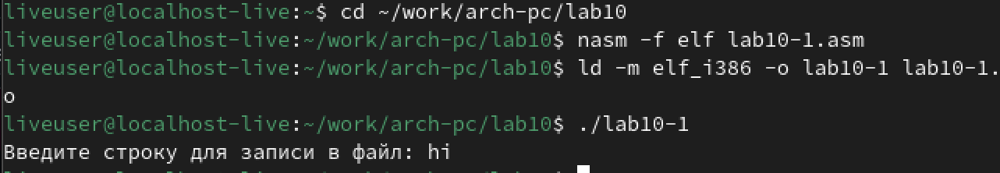

---
## Front matter
title: "Лабораторная работа №10"
subtitle: "Работа с файлами средствами Nasm"
author: "Коровкин Никита Михайлович"

## Generic otions
lang: ru-RU
toc-title: "Содержание"

## Bibliography
bibliography: bib/cite.bib
csl: pandoc/csl/gost-r-7-0-5-2008-numeric.csl

## Pdf output format
toc: true # Table of contents
toc-depth: 2
lof: true # List of figures
lot: true # List of tables
fontsize: 12pt
linestretch: 1.5
papersize: a4
documentclass: scrreprt
## I18n polyglossia
polyglossia-lang:
  name: russian
  options:
	- spelling=modern
	- babelshorthands=true
polyglossia-otherlangs:
  name: english
## I18n babel
babel-lang: russian
babel-otherlangs: english
## Fonts
mainfont: IBM Plex Serif
romanfont: IBM Plex Serif
sansfont: IBM Plex Sans
monofont: IBM Plex Mono
mathfont: STIX Two Math
mainfontoptions: Ligatures=Common,Ligatures=TeX,Scale=0.94
romanfontoptions: Ligatures=Common,Ligatures=TeX,Scale=0.94
sansfontoptions: Ligatures=Common,Ligatures=TeX,Scale=MatchLowercase,Scale=0.94
monofontoptions: Scale=MatchLowercase,Scale=0.94,FakeStretch=0.9
mathfontoptions:
## Biblatex
biblatex: true
biblio-style: "gost-numeric"
biblatexoptions:
  - parentracker=true
  - backend=biber
  - hyperref=auto
  - language=auto
  - autolang=other*
  - citestyle=gost-numeric
## Pandoc-crossref LaTeX customization
figureTitle: "Рис."
tableTitle: "Таблица"
listingTitle: "Листинг"
lofTitle: "Список иллюстраций"
lotTitle: "Список таблиц"
lolTitle: "Листинги"
## Misc options
indent: true
header-includes:
  - \usepackage{indentfirst}
  - \usepackage{float} # keep figures where there are in the text
  - \floatplacement{figure}{H} # keep figures where there are in the text
---

# Цель работы

Приобрести навыки работы с файлами в Ассемблере, а также разобраться с понятием прав доступа в linux

# Выполнение лабораторной работы

Для начала нам необходимо создать рабочую папку и файл lab10-1.asm, а также файлы readme-1.txt и readme-2.txt(рис.1)

Скопируем файл in_out.asm из папки прошлой работы.(рис.2)

Теперь вставим в файл lab10-1.asm код из листинга 10.1(рис.3)

Запустим программу и посмотрим на результат.(рис.4)

Как видно из вывода, файл выполнился, но ничего не произошло, так как в коде прописано записать данные в файл readme.txt, которого не существует.

Тогда попробуем изменить права доступа для программы lab10-1 так, чтобы запретить всем группам пользователей запускать эту программу и попробуем запустить ее еще раз.(рис.5)

После изменения прав доступа мы попробовали вновь запустить программу, и нам отказали в доступе.

Теперь попробуем добавить к файлу с кодом lab10-1.asm права на запуск, и попробуем его запустить.(рис.6)

Терминал вывел много ошибок, так как файл не предназначен для запуска. 

Теперь попробуем выдать права доступа для файлов readme-1.txt и readme-2.txt согласно варианту 16. Так, мы используем chmod и пишем права доступа в восьмиричном виде.(рис.7)

Права доступа установлены корректно.

#Выполнение самостоятельной работы

Для начала создадим файл с которым будем работать.(рис.8)

Теперь напишем код, который должен создать файл name.txt, записать туда фразу "Меня зовут", запросить Фамилию и Имя пользователя и дописать их в файл.(рис.9-11)

Теперь запустим код, проверим, создался ли файл, и то, что в него записалось.(рис.12)

Все работает верно. Работа выполнена правильно.

# Выводы

В ходе выполнения данной лабораторной работы были получены навыки работы с файлами в Ассемблере, а также знания о правах доступа файлов.
